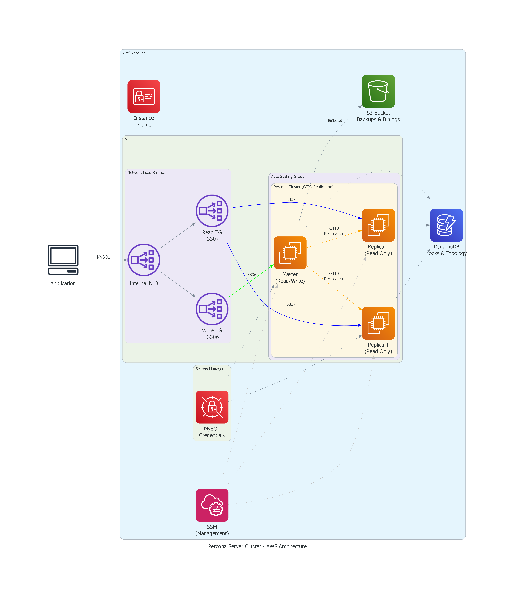

# terraform-aws-percona-server

[](https://infrahouse.com/contact)
[](https://infrahouse.github.io/terraform-aws-percona-server/)
[](https://registry.terraform.io/modules/infrahouse/percona-server/aws/latest)
[](https://github.com/infrahouse/terraform-aws-percona-server/releases/latest)
[](https://github.com/infrahouse/terraform-aws-percona-server/actions/workflows/vuln-scanner-pr.yml)
[](LICENSE)

[](https://docs.percona.com/percona-server/8.0/)
[](https://aws.amazon.com/ec2/)
[](https://aws.amazon.com/dynamodb/)
[](https://aws.amazon.com/s3/)

> **Work in Progress**: This module is under active development. Core infrastructure is complete and tested. See [Development Status](#development-status) for details.

Terraform module for deploying a highly available Percona Server (MySQL 8.0) cluster on AWS with GTID-based replication, automatic failover, and automated backups.

## Why Self-Managed MySQL?

While AWS RDS provides a managed MySQL solution, self-managed Percona Server offers several advantages:

- **Cost Efficiency**: Up to 50-70% cost savings compared to RDS, especially at scale
- **Full Control**: Root access, custom configurations, and any MySQL plugin
- **Performance Tuning**: Direct access to `my.cnf`, buffer pool, and query optimization
- **Instance Store Support**: Use NVMe SSDs for high-IOPS workloads (up to 3.3M IOPS on i3en instances)
- **Percona Toolkit**: Access to pt-online-schema-change, pt-query-digest, and other tools
- **Compliance**: Keep data in your VPC with full audit trail and encryption control

## Architecture



### Components

| Component | Purpose |
|-----------|---------|
| **Auto Scaling Group** | Manages EC2 instances with rolling updates and self-healing |
| **Network Load Balancer** | Provides separate write (`:3306`) and read (`:3307`) endpoints |
| **DynamoDB Table** | Distributed locking for master election and coordination |
| **S3 Bucket** | Stores XtraBackup snapshots and archived binlogs |
| **Secrets Manager** | Securely stores MySQL credentials (root, replication, backup, monitor) |
| **Security Group** | Controls MySQL, Orchestrator, and cluster communication |

### Data Flow

1. **Write Traffic**: Applications connect to NLB port 3306 → routed to master only
2. **Read Traffic**: Applications connect to NLB port 3307 → load-balanced across replicas
3. **Replication**: Master streams changes via GTID to all replicas
4. **Backups**: XtraBackup streams full/incremental backups to S3

## Development Status

### Completed

- [x] **Infrastructure (Terraform)**
  - [x] Auto Scaling Group with launch template
  - [x] Network Load Balancer with write/read target groups
  - [x] DynamoDB table for coordination
  - [x] S3 bucket with lifecycle policies for backups
  - [x] Security groups for MySQL, Orchestrator, and internal traffic
  - [x] IAM roles and instance profiles
  - [x] Secrets Manager integration for MySQL credentials
  - [x] Cloud-init integration with Puppet facts
  - [x] Instance refresh triggers on configuration changes

- [x] **MySQL Configuration (Puppet)**
  - [x] Percona Server 8.0 installation
  - [x] GTID-based replication setup
  - [x] User management (root, replication, backup, monitor)
  - [x] Target group registration (master → write TG, replicas → read TG)

### In Progress

- [ ] **Orchestrator Integration**
  - [ ] Orchestrator installation and Raft cluster setup
  - [ ] Automated failover with topology detection
  - [ ] Web UI for cluster visualization

### Planned

- [ ] **Backup Automation**
  - [ ] Scheduled XtraBackup to S3
  - [ ] Binlog archival for point-in-time recovery
  - [ ] Restore procedures and documentation

- [ ] **Monitoring & Alerting**
  - [ ] CloudWatch metrics for replication lag, connections, queries
  - [ ] PMM (Percona Monitoring and Management) integration
  - [ ] SNS alerts for failover events

- [ ] **Advanced Features**
  - [ ] Read replica auto-scaling based on load
  - [ ] Cross-region replication support
  - [ ] Encryption at rest with customer-managed KMS keys

## Quick Start

```hcl
module "percona" {
  source  = "infrahouse/percona-server/aws"
  version = "0.2.0"

  cluster_id     = "my-database"
  environment    = "production"
  subnet_ids     = ["subnet-abc123", "subnet-def456", "subnet-ghi789"]
  instance_count = 3
  instance_type  = "r6g.xlarge"
}

# Connect to the database
output "writer_endpoint" {
  value = module.percona.writer_endpoint  # NLB:3306 → master
}

output "reader_endpoint" {
  value = module.percona.reader_endpoint  # NLB:3307 → replicas
}
```

## Usage

### Basic Configuration

```hcl
module "percona" {
  source  = "infrahouse/percona-server/aws"
  version = "0.2.0"

  # Required
  cluster_id   = "myapp-db"
  environment  = "production"
  subnet_ids   = data.aws_subnets.private.ids

  # Optional - customize as needed
  instance_count        = 3              # Must be odd, minimum 3
  instance_type         = "r6g.xlarge"   # Memory-optimized recommended
  root_volume_size      = 200            # GB for MySQL data
  backup_retention_weeks = 4             # S3 lifecycle policy
}
```

### High-IOPS Configuration (Instance Store)

For workloads requiring maximum disk performance, use instance types with NVMe storage:

```hcl
module "percona" {
  source  = "infrahouse/percona-server/aws"
  version = "0.2.0"

  cluster_id    = "high-iops-db"
  environment   = "production"
  subnet_ids    = data.aws_subnets.private.ids

  # i3en instances have NVMe SSDs - automatically detected and used
  instance_type = "i3en.xlarge"  # 2x 1.25TB NVMe, up to 200K IOPS
}
```

> **Note**: Instance store data is ephemeral. The module automatically:
> - Creates a LUKS-encrypted RAID array from NVMe drives
> - Stores the LUKS passphrase in Secrets Manager
> - Relies on replication for durability (not local disk)

### Custom Puppet Configuration

```hcl
module "percona" {
  source  = "infrahouse/percona-server/aws"
  version = "0.2.0"

  cluster_id   = "custom-db"
  environment  = "production"
  subnet_ids   = data.aws_subnets.private.ids

  # Puppet configuration
  puppet_role            = "percona_server"
  puppet_debug_logging   = true
  puppet_root_directory  = "/opt/my-puppet-code"

  # Additional Puppet facts
  puppet_custom_facts = {
    mysql_buffer_pool_size = "8G"
    enable_slow_query_log  = true
  }

  # Extra packages to install
  extra_packages = ["percona-toolkit", "sysbench"]
}
```

## Connecting to the Database

### Application Connection

```python
# Python example using mysql-connector
import mysql.connector

# Write operations (master only)
writer = mysql.connector.connect(
    host="prc-xxxxx.elb.us-west-2.amazonaws.com",
    port=3306,
    user="app_user",
    password="...",
    database="myapp"
)

# Read operations (load-balanced replicas)
reader = mysql.connector.connect(
    host="prc-xxxxx.elb.us-west-2.amazonaws.com",
    port=3307,  # Different port for reads
    user="app_user",
    password="...",
    database="myapp"
)
```

### Management Access

Instances are in private subnets. Use AWS SSM Session Manager:

```bash
# Connect via SSM
aws ssm start-session --target i-0123456789abcdef0

# Then connect to MySQL locally
mysql -u root
```


<!-- BEGIN_TF_DOCS -->

## Requirements

| Name | Version |
|------|---------|
| <a name="requirement_terraform"></a> [terraform](#requirement\_terraform) | ~> 1.5 |
| <a name="requirement_aws"></a> [aws](#requirement\_aws) | >= 5.62, < 7.0 |
| <a name="requirement_random"></a> [random](#requirement\_random) | ~> 3.6 |

## Providers

| Name | Version |
|------|---------|
| <a name="provider_aws"></a> [aws](#provider\_aws) | >= 5.62, < 7.0 |
| <a name="provider_random"></a> [random](#provider\_random) | ~> 3.6 |

## Modules

| Name | Source | Version |
|------|--------|---------|
| <a name="module_backups"></a> [backups](#module\_backups) | registry.infrahouse.com/infrahouse/s3-bucket/aws | 0.3.1 |
| <a name="module_cloud_init"></a> [cloud\_init](#module\_cloud\_init) | registry.infrahouse.com/infrahouse/cloud-init/aws | 2.2.2 |
| <a name="module_instance_profile"></a> [instance\_profile](#module\_instance\_profile) | registry.infrahouse.com/infrahouse/instance-profile/aws | 1.9.0 |
| <a name="module_luks_passphrase"></a> [luks\_passphrase](#module\_luks\_passphrase) | registry.infrahouse.com/infrahouse/secret/aws | 1.1.1 |
| <a name="module_mysql_credentials"></a> [mysql\_credentials](#module\_mysql\_credentials) | registry.infrahouse.com/infrahouse/secret/aws | 1.1.1 |

## Resources

| Name | Type |
|------|------|
| [aws_autoscaling_group.percona](https://registry.terraform.io/providers/hashicorp/aws/latest/docs/resources/autoscaling_group) | resource |
| [aws_dynamodb_table.percona](https://registry.terraform.io/providers/hashicorp/aws/latest/docs/resources/dynamodb_table) | resource |
| [aws_launch_template.percona](https://registry.terraform.io/providers/hashicorp/aws/latest/docs/resources/launch_template) | resource |
| [aws_lb.percona](https://registry.terraform.io/providers/hashicorp/aws/latest/docs/resources/lb) | resource |
| [aws_lb_listener.read](https://registry.terraform.io/providers/hashicorp/aws/latest/docs/resources/lb_listener) | resource |
| [aws_lb_listener.write](https://registry.terraform.io/providers/hashicorp/aws/latest/docs/resources/lb_listener) | resource |
| [aws_lb_target_group.read](https://registry.terraform.io/providers/hashicorp/aws/latest/docs/resources/lb_target_group) | resource |
| [aws_lb_target_group.write](https://registry.terraform.io/providers/hashicorp/aws/latest/docs/resources/lb_target_group) | resource |
| [aws_s3_bucket_lifecycle_configuration.backups](https://registry.terraform.io/providers/hashicorp/aws/latest/docs/resources/s3_bucket_lifecycle_configuration) | resource |
| [aws_security_group.percona](https://registry.terraform.io/providers/hashicorp/aws/latest/docs/resources/security_group) | resource |
| [aws_vpc_security_group_egress_rule.all_outbound](https://registry.terraform.io/providers/hashicorp/aws/latest/docs/resources/vpc_security_group_egress_rule) | resource |
| [aws_vpc_security_group_ingress_rule.icmp](https://registry.terraform.io/providers/hashicorp/aws/latest/docs/resources/vpc_security_group_ingress_rule) | resource |
| [aws_vpc_security_group_ingress_rule.mysql_client_cidr](https://registry.terraform.io/providers/hashicorp/aws/latest/docs/resources/vpc_security_group_ingress_rule) | resource |
| [aws_vpc_security_group_ingress_rule.mysql_client_sg](https://registry.terraform.io/providers/hashicorp/aws/latest/docs/resources/vpc_security_group_ingress_rule) | resource |
| [aws_vpc_security_group_ingress_rule.mysql_internal](https://registry.terraform.io/providers/hashicorp/aws/latest/docs/resources/vpc_security_group_ingress_rule) | resource |
| [aws_vpc_security_group_ingress_rule.mysql_vpc](https://registry.terraform.io/providers/hashicorp/aws/latest/docs/resources/vpc_security_group_ingress_rule) | resource |
| [aws_vpc_security_group_ingress_rule.orchestrator_http](https://registry.terraform.io/providers/hashicorp/aws/latest/docs/resources/vpc_security_group_ingress_rule) | resource |
| [aws_vpc_security_group_ingress_rule.orchestrator_raft](https://registry.terraform.io/providers/hashicorp/aws/latest/docs/resources/vpc_security_group_ingress_rule) | resource |
| [random_password.luks_passphrase](https://registry.terraform.io/providers/hashicorp/random/latest/docs/resources/password) | resource |
| [random_password.mysql_backup](https://registry.terraform.io/providers/hashicorp/random/latest/docs/resources/password) | resource |
| [random_password.mysql_monitor](https://registry.terraform.io/providers/hashicorp/random/latest/docs/resources/password) | resource |
| [random_password.mysql_replication](https://registry.terraform.io/providers/hashicorp/random/latest/docs/resources/password) | resource |
| [random_password.mysql_root](https://registry.terraform.io/providers/hashicorp/random/latest/docs/resources/password) | resource |
| [aws_ami.selected](https://registry.terraform.io/providers/hashicorp/aws/latest/docs/data-sources/ami) | data source |
| [aws_ami.ubuntu](https://registry.terraform.io/providers/hashicorp/aws/latest/docs/data-sources/ami) | data source |
| [aws_caller_identity.current](https://registry.terraform.io/providers/hashicorp/aws/latest/docs/data-sources/caller_identity) | data source |
| [aws_ec2_instance_type.selected](https://registry.terraform.io/providers/hashicorp/aws/latest/docs/data-sources/ec2_instance_type) | data source |
| [aws_iam_policy_document.percona](https://registry.terraform.io/providers/hashicorp/aws/latest/docs/data-sources/iam_policy_document) | data source |
| [aws_region.current](https://registry.terraform.io/providers/hashicorp/aws/latest/docs/data-sources/region) | data source |
| [aws_subnet.selected](https://registry.terraform.io/providers/hashicorp/aws/latest/docs/data-sources/subnet) | data source |
| [aws_vpc.selected](https://registry.terraform.io/providers/hashicorp/aws/latest/docs/data-sources/vpc) | data source |

## Inputs

| Name | Description | Type | Default | Required |
|------|-------------|------|---------|:--------:|
| <a name="input_ami_id"></a> [ami\_id](#input\_ami\_id) | AMI ID for the Percona instances. If not specified, the latest Ubuntu Pro AMI for var.ubuntu\_codename will be used.<br/>Set to null to use the default Ubuntu AMI. | `string` | `null` | no |
| <a name="input_backup_retention_weeks"></a> [backup\_retention\_weeks](#input\_backup\_retention\_weeks) | Number of weeks to retain backups in S3 | `number` | `4` | no |
| <a name="input_client_cidrs"></a> [client\_cidrs](#input\_client\_cidrs) | List of CIDR blocks allowed to connect to MySQL. If both this and client\_security\_group\_ids are empty, VPC CIDR is used. | `list(string)` | `[]` | no |
| <a name="input_client_security_group_ids"></a> [client\_security\_group\_ids](#input\_client\_security\_group\_ids) | List of security group IDs allowed to connect to MySQL. If both this and client\_cidrs are empty, VPC CIDR is used. | `list(string)` | `[]` | no |
| <a name="input_cluster_id"></a> [cluster\_id](#input\_cluster\_id) | Unique identifier for the Percona cluster | `string` | n/a | yes |
| <a name="input_environment"></a> [environment](#input\_environment) | Environment name (development, staging, production, etc.) | `string` | n/a | yes |
| <a name="input_extra_packages"></a> [extra\_packages](#input\_extra\_packages) | Additional packages to install during instance bootstrap. | `list(string)` | `[]` | no |
| <a name="input_instance_count"></a> [instance\_count](#input\_instance\_count) | Number of instances in the cluster (must be odd, minimum 3) | `number` | `3` | no |
| <a name="input_instance_type"></a> [instance\_type](#input\_instance\_type) | EC2 instance type for the Percona nodes | `string` | `"t3.medium"` | no |
| <a name="input_key_name"></a> [key\_name](#input\_key\_name) | Name of the EC2 key pair for SSH access to instances. If null, no key pair is assigned. | `string` | `null` | no |
| <a name="input_puppet_custom_facts"></a> [puppet\_custom\_facts](#input\_puppet\_custom\_facts) | A map of custom puppet facts. The module uses deep merge to combine user facts<br/>with module-managed facts. User-provided values take precedence on conflicts.<br/><br/>Module automatically provides percona-specific facts for cluster configuration. | `any` | `{}` | no |
| <a name="input_puppet_debug_logging"></a> [puppet\_debug\_logging](#input\_puppet\_debug\_logging) | Enable Puppet debug logging during bootstrap. | `bool` | `false` | no |
| <a name="input_puppet_environmentpath"></a> [puppet\_environmentpath](#input\_puppet\_environmentpath) | A path for directory environments. | `string` | `"{root_directory}/environments"` | no |
| <a name="input_puppet_hiera_config_path"></a> [puppet\_hiera\_config\_path](#input\_puppet\_hiera\_config\_path) | Path to hiera configuration file. | `string` | `"{root_directory}/environments/{environment}/hiera.yaml"` | no |
| <a name="input_puppet_manifest"></a> [puppet\_manifest](#input\_puppet\_manifest) | Path to puppet manifest. By default ih-puppet will apply {root\_directory}/environments/{environment}/manifests/site.pp. | `string` | `null` | no |
| <a name="input_puppet_module_path"></a> [puppet\_module\_path](#input\_puppet\_module\_path) | Path to common puppet modules. | `string` | `"{root_directory}/environments/{environment}/modules:{root_directory}/modules"` | no |
| <a name="input_puppet_role"></a> [puppet\_role](#input\_puppet\_role) | Puppet role for the Percona instances. Passed as a puppet fact.<br/>Must contain only lowercase letters, numbers, and underscores (no hyphens). | `string` | `"percona_server"` | no |
| <a name="input_puppet_root_directory"></a> [puppet\_root\_directory](#input\_puppet\_root\_directory) | Path where the puppet code is hosted. | `string` | `"/opt/puppet-code"` | no |
| <a name="input_root_volume_size"></a> [root\_volume\_size](#input\_root\_volume\_size) | Size of the root EBS volume in GB | `number` | `100` | no |
| <a name="input_s3_force_destroy"></a> [s3\_force\_destroy](#input\_s3\_force\_destroy) | Allow the S3 bucket to be destroyed even if it contains objects. Set to true for testing. | `bool` | `false` | no |
| <a name="input_subnet_ids"></a> [subnet\_ids](#input\_subnet\_ids) | List of subnet IDs for the Auto Scaling Group | `list(string)` | n/a | yes |
| <a name="input_tags"></a> [tags](#input\_tags) | Additional tags to apply to all resources | `map(string)` | `{}` | no |
| <a name="input_ubuntu_codename"></a> [ubuntu\_codename](#input\_ubuntu\_codename) | Ubuntu version codename to use for the Percona instances. Only LTS versions are supported. | `string` | `"noble"` | no |

## Outputs

| Name | Description |
|------|-------------|
| <a name="output_asg_arn"></a> [asg\_arn](#output\_asg\_arn) | ARN of the Auto Scaling Group |
| <a name="output_asg_name"></a> [asg\_name](#output\_asg\_name) | Name of the Auto Scaling Group |
| <a name="output_dynamodb_table_arn"></a> [dynamodb\_table\_arn](#output\_dynamodb\_table\_arn) | ARN of the DynamoDB table |
| <a name="output_dynamodb_table_name"></a> [dynamodb\_table\_name](#output\_dynamodb\_table\_name) | Name of the DynamoDB table for locks and topology |
| <a name="output_instance_profile_name"></a> [instance\_profile\_name](#output\_instance\_profile\_name) | Name of the IAM instance profile |
| <a name="output_instance_role_arn"></a> [instance\_role\_arn](#output\_instance\_role\_arn) | ARN of the IAM role attached to Percona instances |
| <a name="output_luks_passphrase_secret_arn"></a> [luks\_passphrase\_secret\_arn](#output\_luks\_passphrase\_secret\_arn) | ARN of the Secrets Manager secret containing LUKS passphrase (only for instance\_store) |
| <a name="output_mysql_credentials_secret_arn"></a> [mysql\_credentials\_secret\_arn](#output\_mysql\_credentials\_secret\_arn) | ARN of the Secrets Manager secret containing MySQL user credentials |
| <a name="output_mysql_credentials_secret_name"></a> [mysql\_credentials\_secret\_name](#output\_mysql\_credentials\_secret\_name) | Name of the Secrets Manager secret containing MySQL user credentials |
| <a name="output_nlb_arn"></a> [nlb\_arn](#output\_nlb\_arn) | ARN of the Network Load Balancer |
| <a name="output_nlb_dns_name"></a> [nlb\_dns\_name](#output\_nlb\_dns\_name) | DNS name of the Network Load Balancer |
| <a name="output_read_target_group_arn"></a> [read\_target\_group\_arn](#output\_read\_target\_group\_arn) | ARN of the read (replica) target group |
| <a name="output_reader_endpoint"></a> [reader\_endpoint](#output\_reader\_endpoint) | MySQL reader endpoint (replicas) - host:port |
| <a name="output_s3_bucket_arn"></a> [s3\_bucket\_arn](#output\_s3\_bucket\_arn) | ARN of the S3 bucket |
| <a name="output_s3_bucket_name"></a> [s3\_bucket\_name](#output\_s3\_bucket\_name) | Name of the S3 bucket for backups and binlogs |
| <a name="output_security_group_id"></a> [security\_group\_id](#output\_security\_group\_id) | ID of the Percona cluster security group |
| <a name="output_storage_type"></a> [storage\_type](#output\_storage\_type) | Storage type used for MySQL data: 'ebs' or 'instance\_store' |
| <a name="output_write_target_group_arn"></a> [write\_target\_group\_arn](#output\_write\_target\_group\_arn) | ARN of the write (master) target group |
| <a name="output_writer_endpoint"></a> [writer\_endpoint](#output\_writer\_endpoint) | MySQL writer endpoint (master) - host:port |
<!-- END_TF_DOCS -->

## Related Projects

- [puppet-code](https://github.com/infrahouse/puppet-code) - Puppet manifests for Percona Server configuration
- [terraform-aws-cloud-init](https://registry.infrahouse.com/infrahouse/cloud-init/aws) - Cloud-init module for EC2 bootstrapping
- [Percona Server Documentation](https://docs.percona.com/percona-server/8.0/)
- [Orchestrator Documentation](https://github.com/openark/orchestrator)

## Contributing

See [CONTRIBUTING.md](CONTRIBUTING.md) for contribution guidelines.

## License

Apache 2.0 Licensed. See [LICENSE](LICENSE) for full details.
